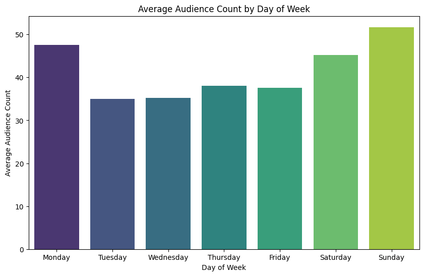

# Cinema Audience Count Prediction | Kaggle Competition (IIT Madras)

## Overview
This project was completed as part of an official **Kaggle competition conducted by IIT Madras** within the Data Science curriculum. The competition focused on predicting cinema audience count (footfall) across multiple theaters over a given time period using historical booking data.

Since the competition host disabled public sharing of notebooks on Kaggle, I am sharing my complete solution here, including the analytical workflow, feature engineering, and modeling approach.

## Problem Statement
Develop a predictive model to forecast theater audience counts using historical booking data, enabling improved demand planning and operational decision-making.

## Approach
**Conducted exploratory data analysis to understand audience trends, seasonality, and theater-level variations.**
 

 ### Key Insight

Observed that **Monday cinema footfall was approximately 30% higher than other weekdays and 5% higher than Saturdays**, making it an unexpected demand spike.

### Exploratory Hypotheses *(Not validated due to dataset limitations)*

The available dataset did not contain sufficient information to determine the underlying cause of this pattern. Possible explanations include:

- **📅Friday releases:** Movies typically release on Fridays, with audience interest carrying over into Monday.
- **💰Price sensitivity:** Higher weekend ticket prices may encourage some moviegoers to wait until Monday.
- **🎟️Weekend capacity constraints:** Sold-out or crowded weekend shows may shift demand to Monday.
- **📱Word-of-mouth effect:** Positive reviews and social media discussions over the weekend may increase Monday attendance.
- **👥Scheduling preferences:** Students or individuals with flexible schedules may prefer weekday movie outings.

> These hypotheses are speculative due to dataset limitations and would require additional data (e.g., ticket pricing, occupancy rates, marketing campaigns, and audience demographics) for validation. If confirmed, they could inform data-driven marketing, pricing, and promotional strategies to maximize Monday footfall and revenue.
- Detected data inconsistencies such as missing records, sparse entries, and outliers, and applied appropriate preprocessing techniques.  
- Engineered a **day-of-week** feature based on EDA insights, improving the model's predictive accuracy.  
- Trained and evaluated multiple regression models, implementing cross-validation to ensure robustness.  
- Tuned hyperparameters to enhance predictive accuracy and reduce overfitting.  

## Tech Stack
**Python**, Pandas, NumPy, Scikit-learn, XGBoost, Jupyter Notebook  

---

*Note: The dataset is not included in this repository due to competition policies.*
